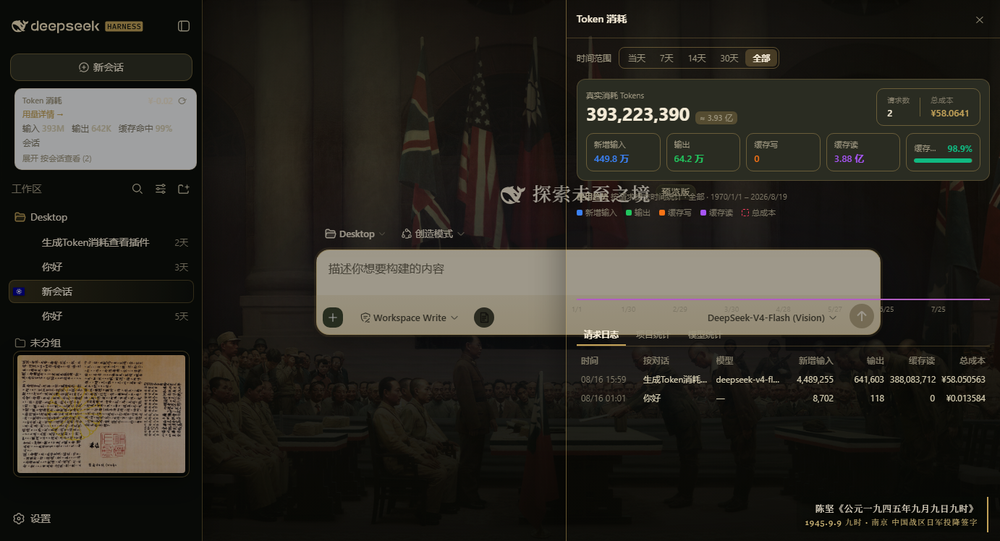
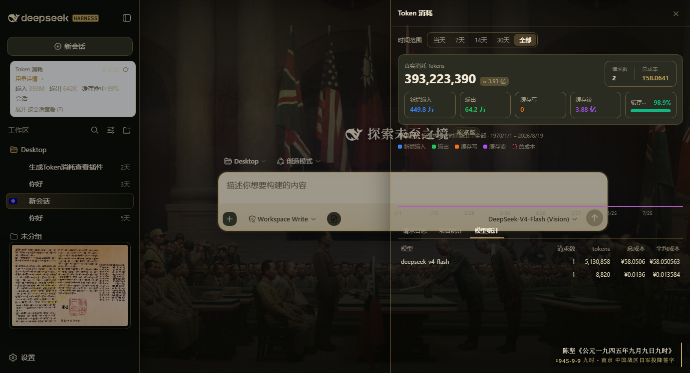
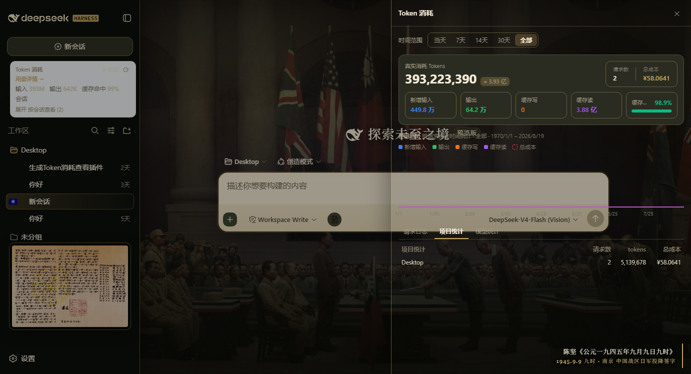

# dsh-token-viewer

DeepSeek Harness 网页端 **CC Switch 风格 Token 消耗统计**插件。纯只读界面：数据来自 host 已算好的会话投影 + 一次余额读取；不添加任何提示词内容、工具或提供方请求。

> **一键安装：**
> ```
> dsh plugin add qwert702/dsh-token-viewer
> ```
> 重启 harness、刷新网页后，点击侧边栏面板列表里的 **Token** 图标；账号余额同时以 chip 形式显示在侧边栏底部。

适配官方 **0.2.0-rc.2**（并兼容 0.1.6+——slot 名、投影 API 与服务契约在这些版本间均未变化；**v0.3.0** 起改用 loader 注入的插件 `Config` 导出作为配置通道，取代已移除的 `settings.register`）。早期版本会禁用官方 `ui-sidebar` 插件、fork 它的 `sidebar.workspaces.header` 插槽；该插槽在 0.1.6 已移除，因此 **v0.2.1 起不再覆盖任何官方插件**，改为注册进原生插槽。跑旧版 harness 请锁 v0.2.0。

## 功能

- **侧边栏面板** — 侧边栏全局面板列表里的 **Token** 行；点击后主区打开插件页面：DeepSeek 账号余额（可刷新；host 代理失败显示错误重试）+ 全会话用量汇总，可展开按会话明细。
- **余额 chip** — 侧边栏底部常驻账号余额（宽栏显示完整金额，收起成轨道时显示货币符号）；点击打开统计抽屉。
- **鲸鱼娘宠物** — 右下角常驻一只原创内联 SVG 的 Q 版鲸鱼娘（女仆头饰，不使用任何第三方素材），实时显示当前牌价时段：谷时闭眼睡觉（🌙 角标 + 💤 上浮），北京高峰时段睁眼冒汗（⚡ 角标）。悬浮提示当前时段、下一窗口倒计时与现行 flash 牌价；点击打开统计抽屉，抽屉展开时宠物自动让位。
- **TokenDock** — 输入区上方悬浮条：当前会话计费输入（未缓存 + 缓存读 + 缓存写）、输出、缓存命中率、近似上下文占用率。
- **用量统计面板**（`shell.overlay` 抽屉，完整移植 CC Switch 用量看板口径）：
  - **按请求统计** — host 侧 `usageLog` 投影为每条上报用量的 assistant 步骤记录一条（提交时间、模型、四个 token 桶）；所有数字折叠自这些请求记录，而非会话累计值。投影按会话保留最近 10000 条（stateVersion 2），长会话的折叠与线上载荷到此封顶。
  - **Hero** — 真实消耗（新增输入 + 输出 + 缓存写 + 缓存读）、请求数、总成本，下排五卡 + 缓存命中率进度条。
  - **趋势图** — 按每条请求自身的提交时间分桶（当天按小时、多天按天，空桶补零），四个 token 序列 + 虚线成本线。
  - **三个 Tab** — 请求日志（最新在前；点击行打开该会话）、按项目统计、含平均成本的按模型统计。
  - **时间范围** — 当天 / 7天 / 14天 / 30天 / 全部，与 CC Switch 完全一致（N−1 天前本地零点起）。
- **按模型峰谷牌价计费** — 每条请求按其模型与提交时间计费：V4-Flash / V4-Pro 官方牌价（人民币/百万 tokens，缓存写按缓存未命中价），北京高峰（9–12 点、14–18 点）自动翻倍；带版本号的模型 id 前缀匹配，未知模型回退 V4-Flash 空闲价。牌价来自 `GET /api/billing/pricing`（统计抽屉拉取并以浏览器内置镜像表兜底），`PRICING_FALLBACK`（host 半区）保存当前牌价。
- **余额路由** — `GET /api/billing/balance` 经 harness 凭据服务代理 DeepSeek `/user/balance`，API key 永不离开服务器。凭据引用（`apiKeyRef`，默认 `DEEPSEEK_API_KEY`）与提供方地址（`baseURL`）走 profile 中插件条目的 config，未配置时用默认值。

## 截图







## 插槽布局

共六个注册，全部使用原生插槽（见 `src/client/index.ts`）：

| 插槽 | 界面 | Id |
| --- | --- | --- |
| `sidebar.panellist` | 面板行 + 图标 | `token` |
| `main` | 面板页（其 `key` 必须等于面板行的 `id`） | `token` |
| `sidebar.footer.action` | 余额 chip | `token-viewer-balance` |
| `conversation.input.dock` | 实时用量条 | `token-viewer` |
| `shell.overlay` | 统计抽屉 | `token-viewer-detail` |
| `shell.overlay` | 鲸鱼娘宠物 | `token-viewer-pet` |

## 仓库结构

- `src/index.ts` — host 半区源码（余额 + 定价路由，`modelUsage` / `usageLog` 会话投影，均带 `wire` 视图供浏览器读取）。**`src` 是唯一真源。**
- `src/client/**` — 浏览器半区源码：上述五个插槽入口、组件与 CSS Modules。
- `lib/index.js`、`lib/client.js` — harness 实际加载的构建产物。刻意入库，使 `dsh plugin add` 无需构建步骤即可用。
- `scripts/build-client.mjs` — `node scripts/build-client.mjs`：用 esbuild 构建两个半区（`src/index.ts` → `lib/index.js`，`src/client/index.ts` → `lib/client.js`）。`react` 与 harness 其余静态浏览器模块保持 external；`.module.css` 经内置的小型 CSS Modules 插件处理：作用域化类名，并在物化时注入 `<style data-plugin data-plugin-css>`。
- `test/smoke.cjs` — `node test/smoke.cjs`：免 harness 冒烟测试。在 `vm` 沙箱里 stub `window.__ModuleLoader__`，对录制式插槽注册表跑 `apply()`，用 stub kit 渲染每个组件，并真实 import host 半区。

TypeScript monorepo 源码（提取自 `deepseek-ai/deepseek-harness`）保存在 `archive/monorepo-src` 分支。

## 模型牌价

`src/index.ts` 中的 `PRICING_FALLBACK`（构建进 `lib/index.js`）保存当前 DeepSeek 牌价；面板会请求 `GET /api/billing/pricing`，优先采用官方定价页数据，不可达时静默回退内置表。统计抽屉把路由返回的牌价安装为计费表并随之重算成本；浏览器在 `src/client/derive.ts` 里镜像同一份 `MODEL_PRICING_FALLBACK`，路由不可达时退到相同牌价而非凭空估计。按会话列表与输入条悬浮条仍按 V4-Flash 空闲价估算——它们是缺少逐请求时间的聚合近似值。

## License

MIT
